# Oil in Wax

A 2 sided marketplace for candle makers and candle lovers alike

## R7 Identification of the problem you are trying to solve by building this particular marketplace app.

Covid-19 Lockdowns saw a boom in new hobbies and DIY activities. One of such popular activities was candle making. A relatively simple and cheap activity that produces a tangible product.

The problem is that once people have made these candles, they need to be able to dispose of them thoughtfully, beyond giving them to friends and family, this often meant the sale of their product.

Currently, the best advice out there(and there's lots of it!) for budding candlemakers is to sell them on a platform like Facebook marketplace or create their own online store.

Oil in Wax aims to provide an easy to use, professional and niche marketplace for candlemakers to utilise.

## R8 Why is it a problem that needs solving?

For the consumer the problem with sourcing high-quality candles is twofold. To buy a candle from a mass production supplier there is some degree of risk, as it can be difficult to know if potentially toxic ingredients have been included in their recipes.

Ideally, the solution is to buy from a local, small business that can answer questions about what's in the candle, or even create them to meet your specific scent and aroma needs!

The issue with marketplaces like Facebook is that it is both difficult to find exactly what you're looking for, and it's not a designed for purpose marketplace. Likewise, candle sellers have a similar problem when launching their stores and trying to find an audience.

This is where Oil in Wax comes in, it can provide an easy to use platform for sellers, whilst providing ways for consumers to find candle makers they love, and the information they need to make an informed purchase!

## R9/10 Links:

**Deployed App:** https://oil-in-wax.herokuapp.com

**Repository:** https://github.com/ryanjwise/oil-in-wax

## R11 Description of your marketplace app (website), including:

### Purpose

The purpose of Oil in Wax is to facilitate the sale candles made by small, independant producers.

### Functionality / features

User Accounts: Every buyer and seller on the platform must have an account. This allows tracking of purchases and sales accross the site

Sales Listings: Every user will have the option to sell products on the store, when they do so they will be able to see all of their posted listings from one place, take down or edit postings that they have created

Storage of candle types for sellers to quicky template new listings

Payment through stripe

Order system to purchase multiple items from the same seller

Search/Filters: Users will be able to narrow down the list of shown candles based on scents and ingredients

Receipt Mailing through an automated service

### Sitemap

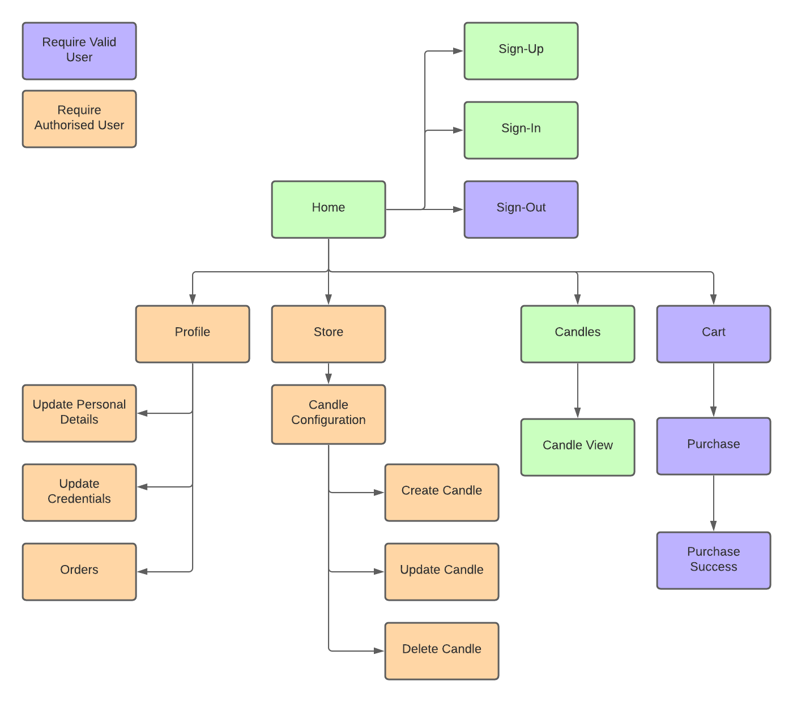

### Screenshots

### Target audience

Oil-In-Wax serves 2 audiences. People who like to buy candles, and small independent candle makers in Australia.

### Tech stack (e.g. html, css, deployment platform, etc)

#### **Front-end**

- HTML
- SCSS
- Bootstrap
- Javascript

#### **Back-end**

- Ruby v2.7.2
- Ruby on Rails v6.1.3
- PostgreSQL

#### **Deployment**

- Heroku (Deployment Platform)

#### **3rd-Parties & Utilities**

- AWS S3 (Image Storage)
- Stripe (Payments)
- Quire.io (Project Management)

## R12 User stories for your app

### Site User

- [x] As a site user, I {want to be able to log in}, {so that all of my information is available when I need it}.
- [x] As a site user, I {want the signin process to be simple}, {so that I can get straight to what I'm looking for}.

### Seller

- [ ] As a seller, I {want to be able to have my own brand identity}, {so that I can build my brand and grow my customer base}.
- [ ] As a seller, I {want to keep track of my previous sales}, {so that I can tell whats popular}.
- [x] As a seller, I {want to list the stock that I can produce}, {so that I can check what I am selling and what I have sold in the past}.
- [ ] As a seller, I {want to have easy access to shipping information of past orders}, {so that my customers can get their goods}.
- [x] As a seller, I {want to be able to sell multiple items in a single transaction}, {so that I can easily send things in the same shipment}.
- [x] As a seller, I {want to be able to sell multiple items in a single transaction}, {so that I my customers find it easier to buy more items}.
- [x] As a seller, I {want to be able to sell multiple items in a single transaction}, {so that I my customers are encouraged to buy more items from me}.
- [ ] As a seller, I {want to be able to close the store to new purchases when I need to}, {so that I can take a break or catch up on back orders}.
- [ ] As a seller, I {want to remove stock from sale when I need to}, {to ensure that I am able to focus my produce to items that sell well, or remove them when ingregients become unavailable}.
- [x] As a seller, I {want only verified customers to place orders}, {so that I can be sure shipping information is correct}.
- [x] As a seller, I {want to be able to update stock prices}, {so that I can stay profitable or competitive}.
- [ ] As a seller, I {want to be able to duplicate existing stock as templates}, {so that I can quickly create new 'versions' of existing product}.
- [ ] As a seller, I {want to be easily found by loyal return customers}, {so that I can retain their business and build rapport}.
- [ ] As a seller, I {want to be notified when somebody places an order}, {so that I can track and manage my forfillments}.
- [ ] As a seller, I {want people to be able to leave reviews of products that they like}, {so that I can update my listings to better meet their needs}.

### Buyer

- [ ] As a buyer, I {want to be able to see past orders}, {so that I know what I've bought and from whom}.
- [ ] As a buyer, I {want to be able to see details of past orders}, {so that I review what I have recieved}.
- [ ] As a buyer, I {want to be able to search for scents that I like}, {so that I don't have to search through everything when I'm after something specific}.
- [ ] As a buyer, I {want to be able to filter specific ingredients}, {so that I can avoid potentially toxic, harmful or ethically damaging ingredients}.
- [ ] As a buyer, I {want to be able to easitly buy from sellers I have bought from before}, {so that I can support business' I trust}.
- [x] As a buyer, I {want to only have to enter my shipping information once}, {so that I don't have to type the same information over, and over again}.
- [ ] As a buyer, I {want the details of my order to stay the same should the seller update their stock}, {so that my past orders remain a source of truth}.
- [ ] As a buyer, I {want to know where my seller is based}, {so that I can buy from local people}.
- [x] As a buyer, I {want a simple purchase experience}, {so that buying candles is easy and not a chore}.
- [x] As a buyer, I {want an easy way to find new sellers}, {so that I can find high quality makers with ease}.
- [ ] As a buyer, I {want to see what other people think of products}, {so that I can make an informed decision}.
- [ ] As a buyer, I {want to be able to update my shipping details}, {so that I can keep my account if I move or need dekivery somewhere else}.
- [ ] As a buyer, I {want to be able to update my password}, {so that I cna keep my account secure if my password becomes compromised}.
- [ ] As a buyer, I {want to be able to update my email}, {so that I can continue to use my account should I migrate to a new email address}.
- [x] As a buyer, I {want to see what a product looks like before purchasing}, {so that I have good expectations about what I am buying}.

## R13 Wireframes for your app

### Navigation

#### Tablet

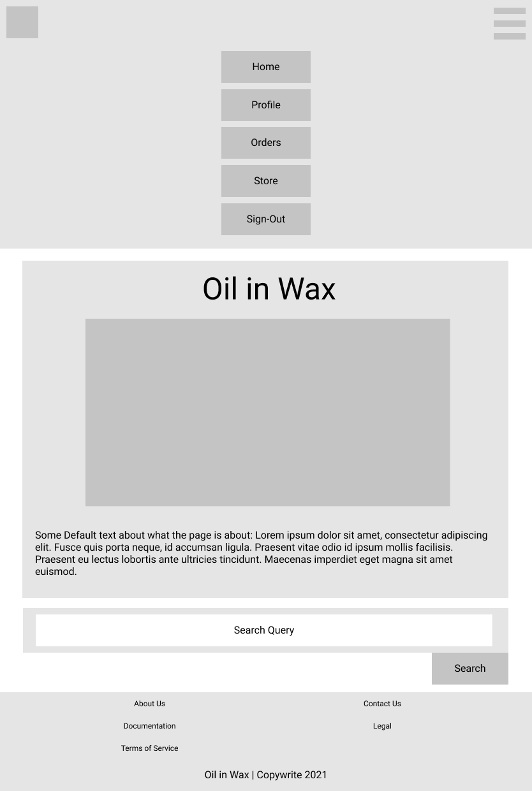

#### Mobile

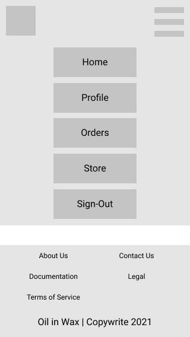
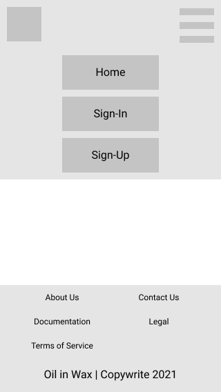

### Home

#### Desktop

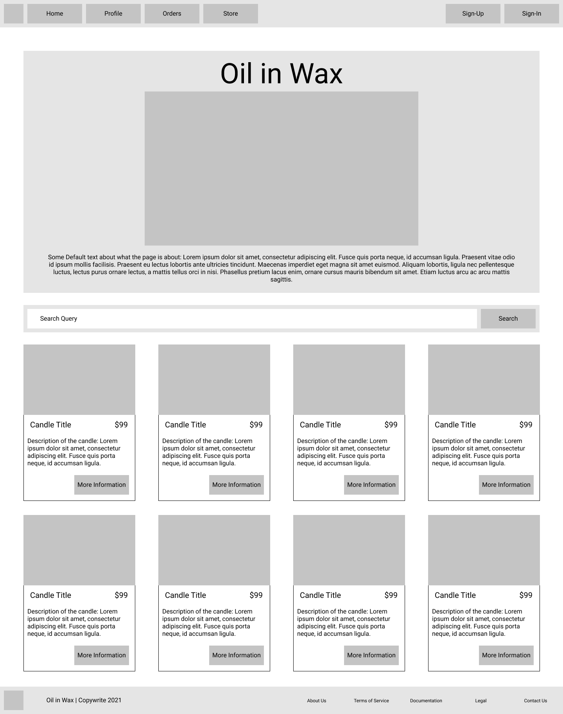

#### Tablet

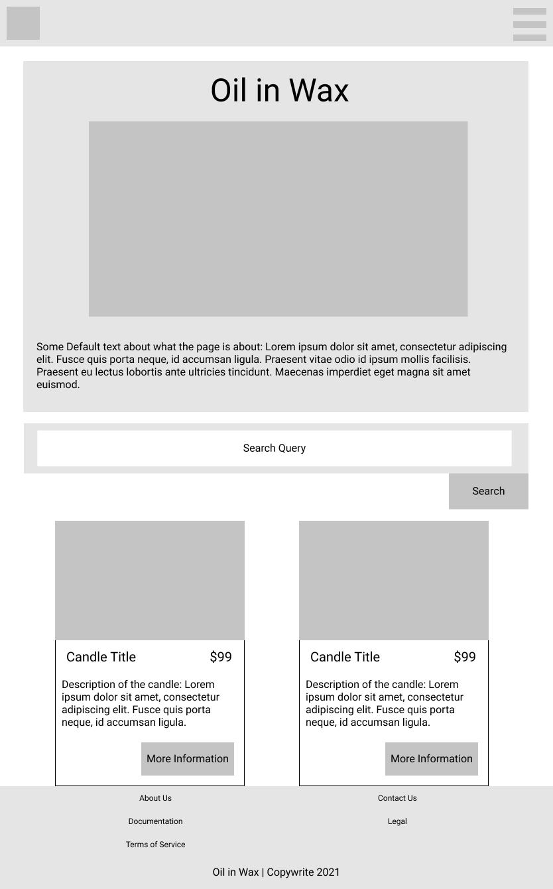

#### Mobile

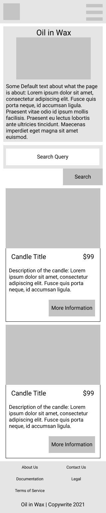

### Profile

#### Desktop

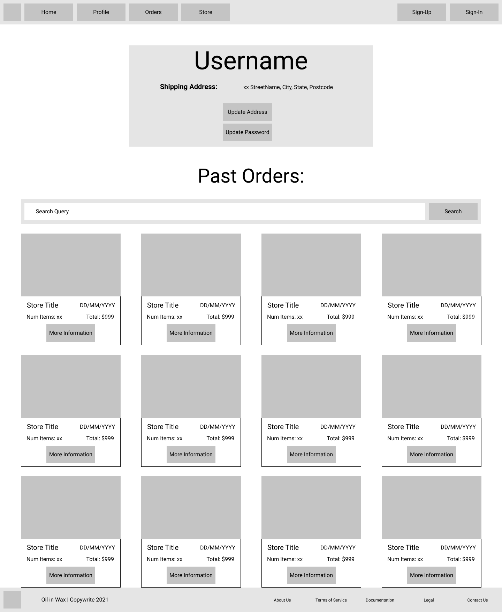

#### Tablet

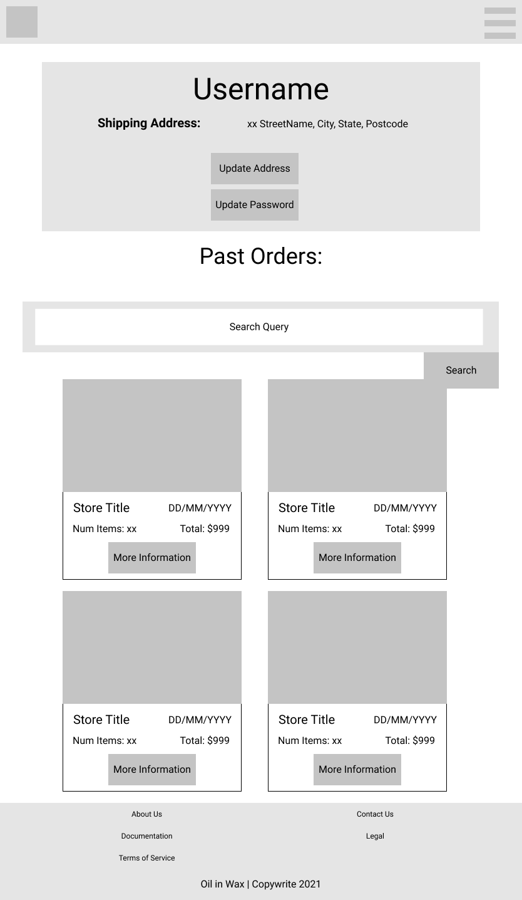

#### Mobile

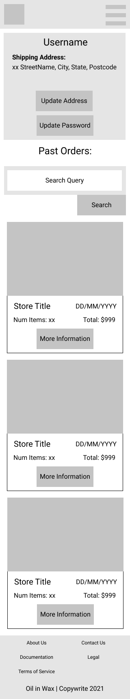

### Store

#### Desktop

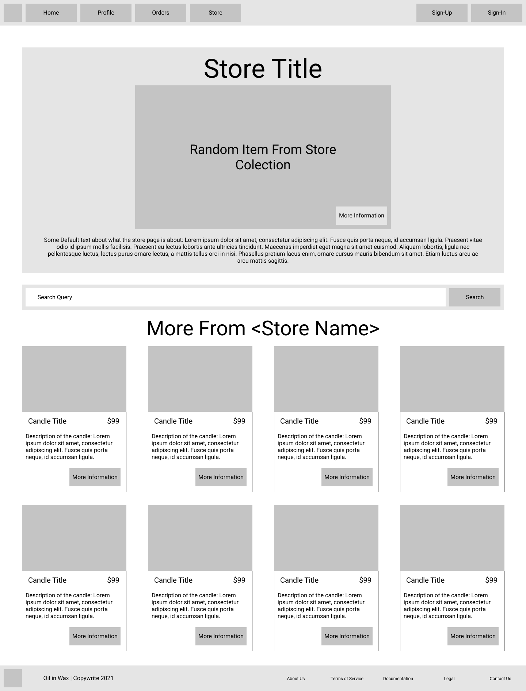

#### Mobile

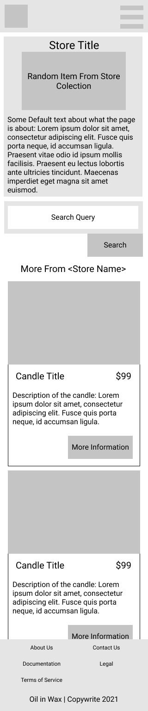

### Administration

#### Desktop

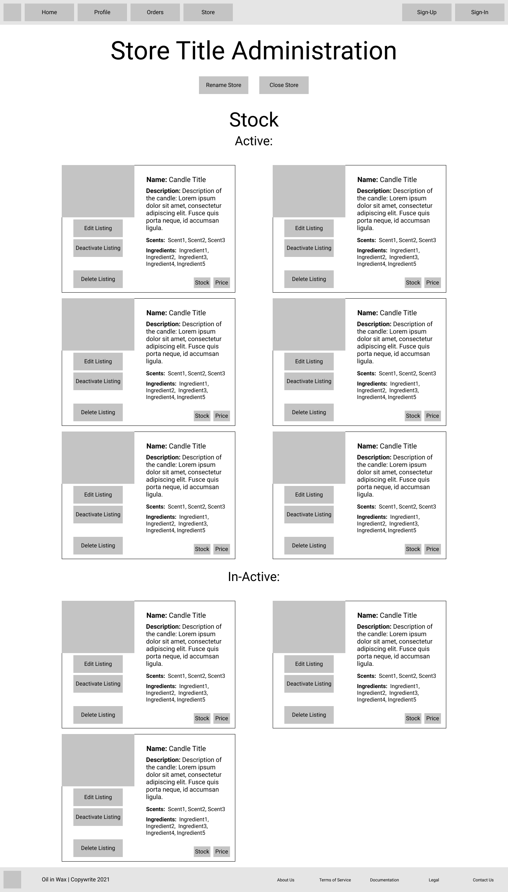

#### Tablet

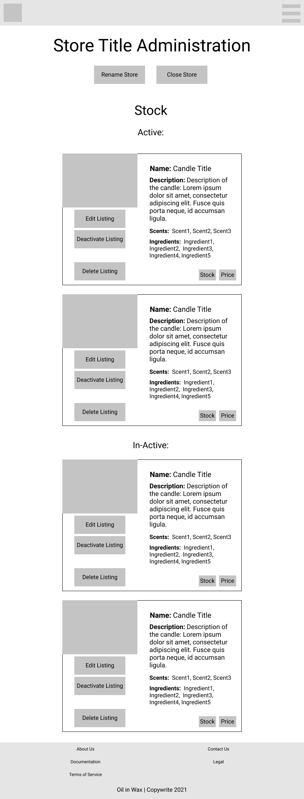

#### Mobile

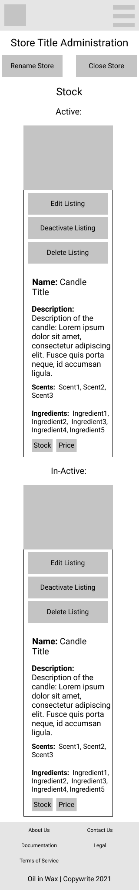

### Candle

#### Desktop

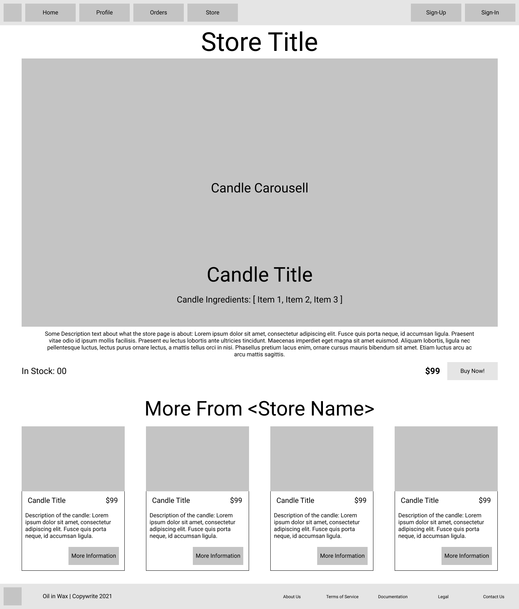

#### Tablet

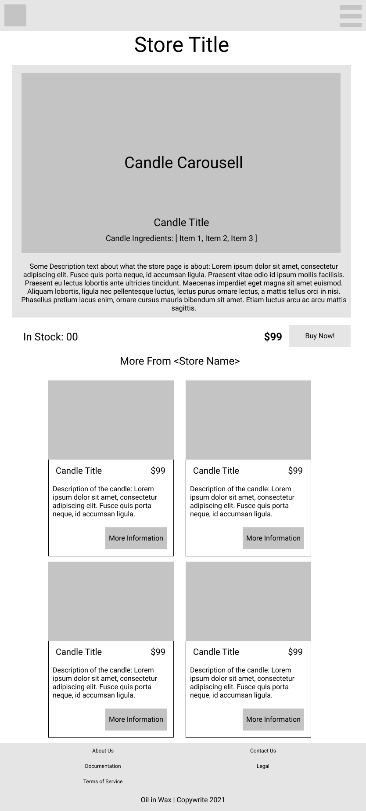

#### Mobile


### Cart

#### Desktop

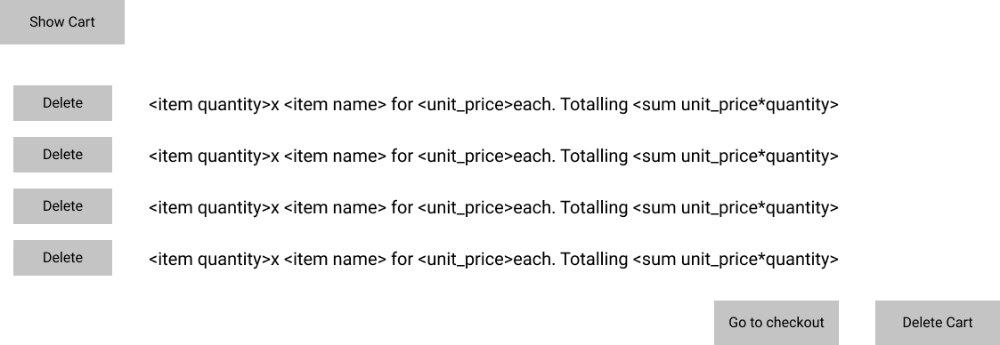

#### Mobile

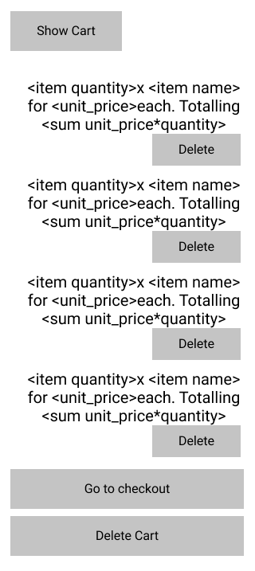

## R14 An ERD for your app

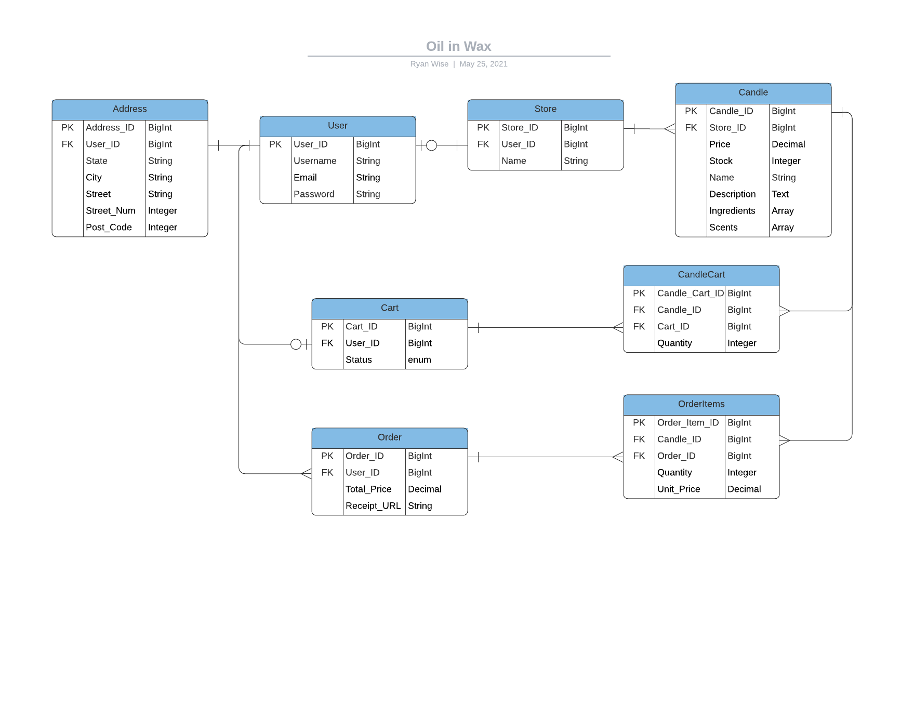

## R15 Explain the different high-level components (abstractions) in your app

## R15 Explain the different high-level components (abstractions) in your app

Built with ruby on rails, Oil-in-Wax follows the MVC architecture to separate its concerns. With the Model(M) controlling the data IO, the View(V) controlling the User Interface, and the Controller(C) handling the logic and translation between the two. Typically each high-level component of the app will have its own Model, View set, and Controller. Although there are additional helper models to assist with data normalisation, controllers with shared scope to deal with intertwined functionality, and shared views to allow consistency throughout the site.

The primary abstractions within the app are as follows:

1. `User`
2. `Store`
3. `Candle`
4. `Cart`
5. `Order`

The `User` is an entity with elevated access and data stored within the app. Whilst anybody can browse to the splash page and look through stock, engaging any further requires a signed-in user account. The MVC for a user is controlled primarily through the devise gem and requires a user to have a unique email address and password. Some alterations have been made to the devise default extending it to require a username to anonymously identify users, and shipping address details through the address model. Update and View methods for User information are handled by the `home` controller. Some data sanitisation for devise is stored in the Application(parent) controller for simplicity.

A single `Store` can be opened by any user. It allows a user to create, update and view any `Candle` listing they may wish to make. All a store needs is a name by which to identify it.

A `Store` can list many `Candles`. Each candle is a separate sale item belonging to a `User` through their `Store`. Each candle will have a price, order count, name, and description. This information is then formatted and used in the listing presented to other users.

A `Cart` is a transient record. It stores a list of candles that a user has expressed an intention to purchase from a single store. Since multiple stores exist within the marketplace, having an item in a cart should restrict users from adding items from other stores. Users can continue to add and remove items from their cart until they are happy and choose to make a purchase, the cart will then render a purchase screen outlining their line items and redirecting them to the Stripe payment screen. At the time of redirection, the cart will enter a 'pending' state and increment the order count of each candle within it. Once confirmation of sale has been received from Stripe, the cart will enter a 'complete' state before generating an `Order` and destroying itself.

An `Order` is a record of sale. It is generated once the `Cart` has confirmed the payment has been successful and links a buying `User` with a purchased `Candle`. The Order also stores information regarding quantities of purchase, the price at the time of sale of each item, total price, and the Stripe receipt. Records of orders are currently rendered by the `home` controller along with user information.

## R16 Detail any third party services that your app will use

**[Stripe](https://stripe.com/en-au):**

Stripe offers a fully accredited 3rd Party payment system and API. In this implementation, it is used in perhaps the simplest way to provide payment to a single source for multiple line items via credit card. The implementation could be further enhanced to facilitate payment to multiple endpoints, through multiple different payment options.

**[AWS](https://aws.amazon.com/s3/):**

Amazon S3 is a cloud storage service. In this implementation, it is used to store active storage blobs or image files. When a view attempts to render an image from the polymorphic  `active storage attachments` table an API request is sent to AWS and the appropriate image is returned.

**[Heroku](https://www.heroku.com/home):**

Heroku is a cloud hosting service for web applications. This application is hosted on a free prototype or hobby dyno, meaning it may be a little slow to load resources when first booting up. 

**[Placeholder](https://placeholder.com/):**

A simple 3rd party image placeholder service. Whenever an image is not provided by a seller a placeholder will be generated in its stead using a simple web GET request to: `https://via.placeholder.com/1600x900?text=No+Image+Available'`

## R17 Describe your projects models in terms of the relationships (active record associations) they have with each other

- A `User` `has_one` `Address`,
  - Thus each `Address` `belongs_to` a `User`
- A `User` `has_one` `Store`,
  - Thus each `Store` `belongs_to` a `User`
- A `User` `has_one` `Cart`,
  - Thus each `Cart` `belongs_to` a `User`
- A `User` `has_many` `Orders`,
  - Thus each `Order` `belongs_to` a `User`

- A `Store` `has_many` `Candles`,
  - Thus each `Candle` `belongs_to` a `Store`

- A `Candle` `has_one_attached` `Picture`,
  - A `Picture` belongs to a polymorphic table, and is not represented by a model
- A `Candle` `has_many` `Candle_Carts`,
  - Thus each `Candle_Cart` `belongs_to` a `Candle`
- A `Candle` `has_many` `Carts` `through` `Candle_Carts`,
  - Thus each `Candle_Cart` joins a `Candle` to a `Cart`
  - A `Cart` does not belong to a `Candle`
- A `Candle` `has_many` `Order_Items`,
  - Thus each `Order_Item` `belongs_to` a `Candle`
- A `Candle` `has_many` `Orders` `through` `Order_Items`,
  - Thus each `Order_Item` joins a `Candle` to an `Order`
  - An `Order` does not belong to a `Candle`

In addition to the relationships listed above: 
- As above an `Order` `has_many` `Candles` `through` `Order_Items`
  - An `Order` also `has_many` `Stores` `through` `Candles`
  - This enables more efficient queries from an `Order` to a corredponding `Store`

```rb
class Address < ApplicationRecord
  belongs_to :user
end

class CandleCart < ApplicationRecord
  belongs_to :candle
  belongs_to :cart
end

class Candle < ApplicationRecord
  belongs_to :store

  has_one_attached :picture
  has_many :candle_carts
  has_many :carts, through: :candle_carts
  has_many :order_items
  has_many :orders, through: :order_items
end

class Cart < ApplicationRecord
  belongs_to :user

  has_many :candle_carts, dependent: :destroy
  has_many :candles, through: :candle_carts
end

class OrderItem < ApplicationRecord
  belongs_to :candle
  belongs_to :order
end

class Order < ApplicationRecord
  belongs_to :user

  has_many :order_items
  has_many :candles, through: :order_items
  has_many :stores, through: :candles
end

class Store < ApplicationRecord
  belongs_to :user
  has_many :candles, dependent: :destroy
end

class User < ApplicationRecord
  has_one :address, dependent: :destroy
  has_one :store, dependent: :destroy
  has_one :cart, dependent: :destroy
  has_many :orders, dependent: :destroy
  accepts_nested_attributes_for :address
end
```

## R18 Discuss the database relations to be implemented in your application

Further database normalisation is possible

Polymorphic join of blobs to all table elemetns
## R19 Provide your database schema design

```rb

```

## R20 Describe the way tasks are allocated and tracked in your project
